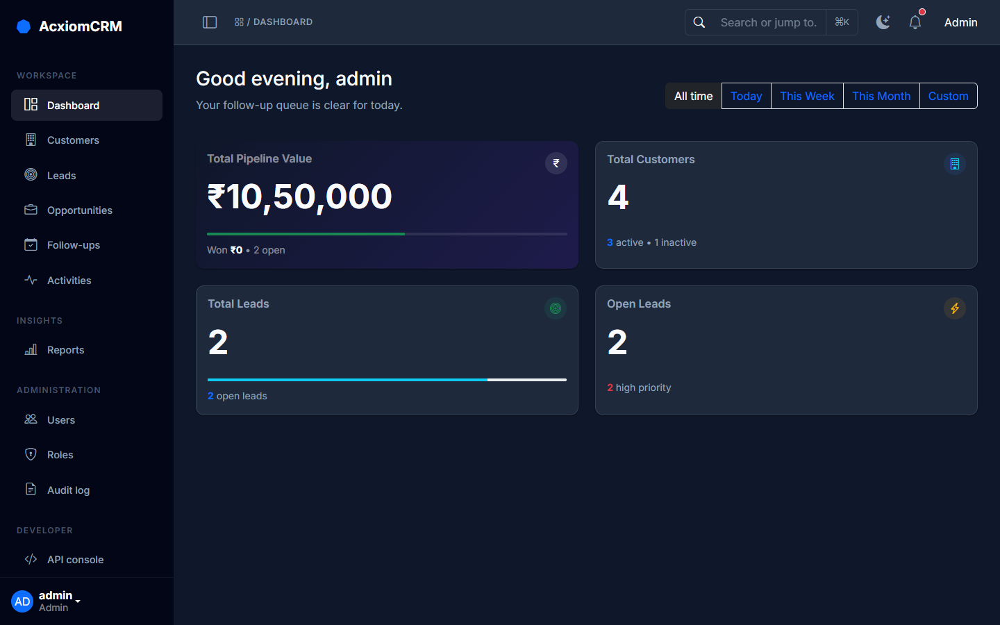
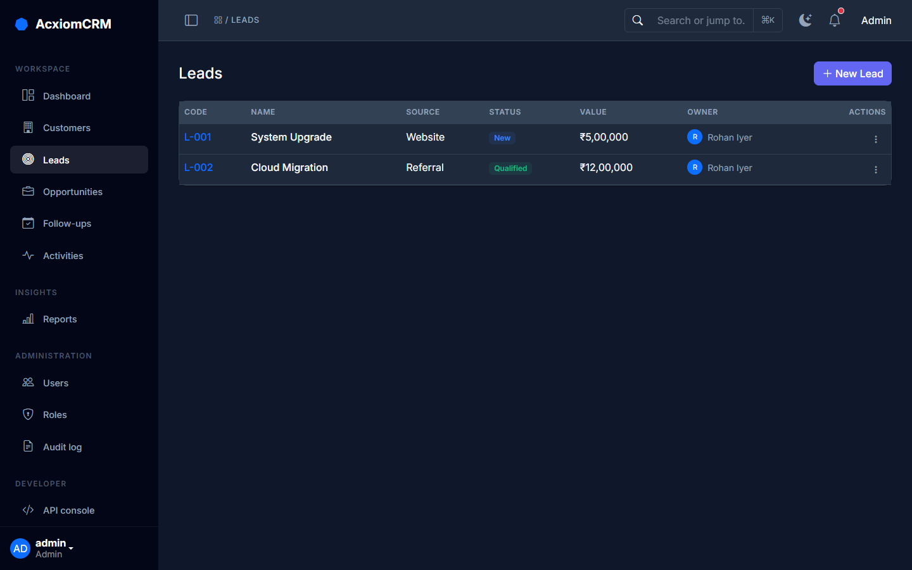
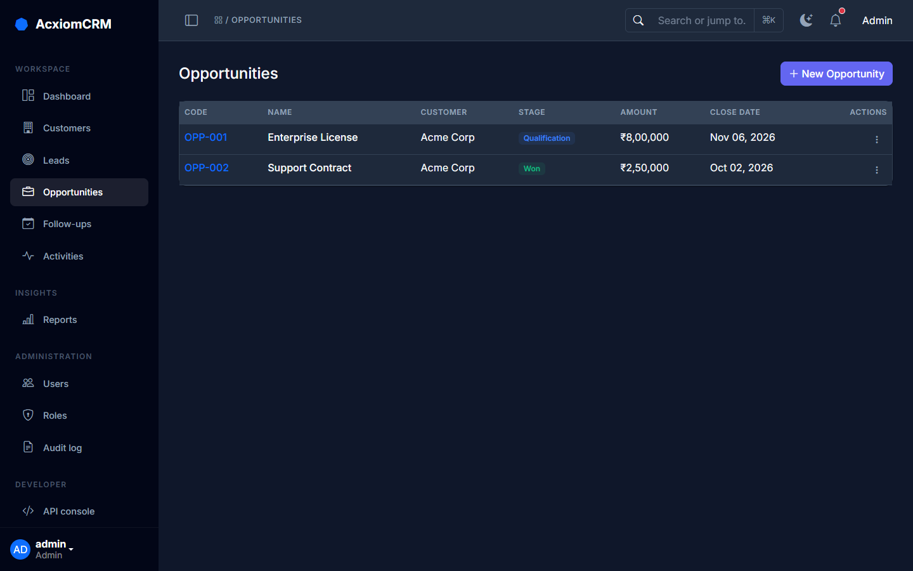
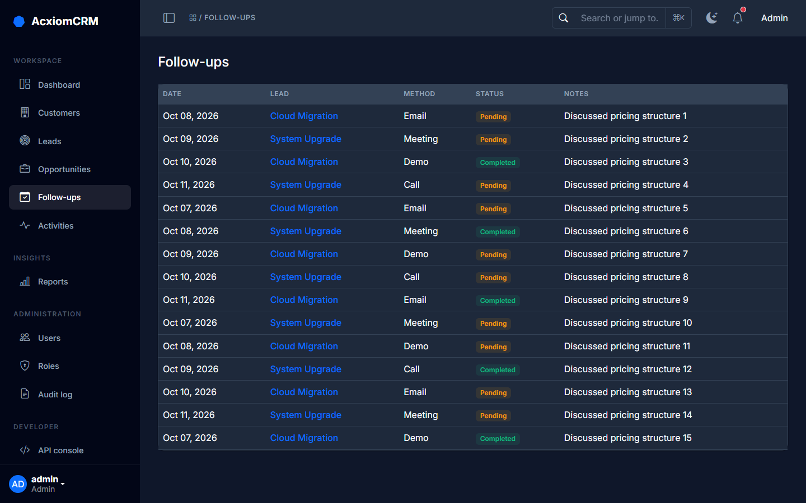
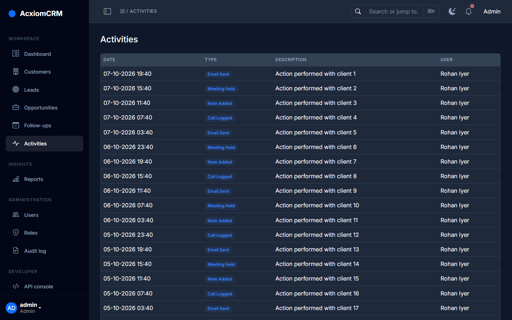
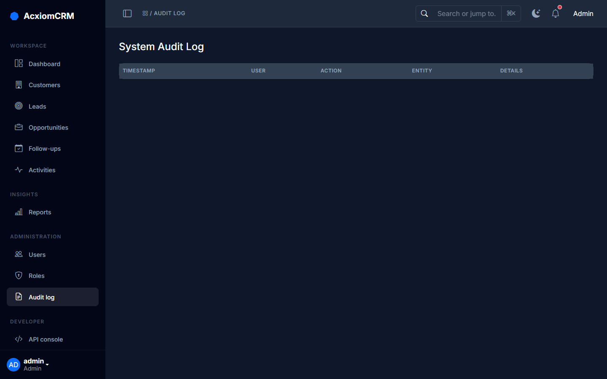
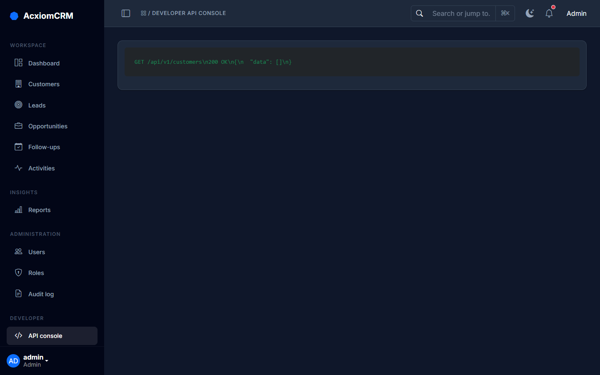

# AcxiomCRM - Project Documentation

## 1. Document Purpose
This document defines the functional scope, module structure, validation requirements, security requirements, role-based authorization, workflows, REST API expectations, audit requirements, and reporting requirements for the AcxiomCRM application.

## 2. Complete Module Structure

| S.NO | Module | Purpose |
|------|--------|---------|
| 1 | **AcxiomCRM** | Application shell, navigation, common UI, configuration and shared services. |
| 2 | **Auth** | Login, logout, password security, policy, lockout, roles and access control. |
| 3 | **Dashboard** | Role-based KPIs, summaries, charts, activities and sales pipeline visibility. |
| 4 | **Customers** | Customer master data, contacts, search, edit, status and customer history. |
| 5 | **Leads** | Lead capture, qualification, assignment, status, conversion and tracking. |
| 6 | **Follow-Ups** | Follow-up scheduling, reminders, status, notes and activity history. |
| 7 | **Users & Roles** | User creation, role assignment, activation/deactivation and access administration. |
| 8 | **Opportunities** | Opportunity pipeline, amount, probability, expected close date and stage management. |
| 9 | **Audit Log** | Security and business activity tracking with user, timestamp, action and record details. |
| 10 | **REST API** | Secure APIs for CRM entities, follow-ups, authentication and reporting data. |
| 11 | **Reports** | Analytics on customers, leads, follow-up, opportunities, pipeline, user activity. |

## 3. Application Architecture
The CRM application follows a layered architecture (ASP.NET Core MVC):
- **Presentation Layer:** Razor Views, Bootstrap UI, Chart.js Dashboards.
- **Application/Business Layer:** Entity Framework Core, Identity Auth, ViewModels, Business Rules.
- **Data/Database Layer:** SQLite (Development) with EF Core Code-First Migrations.

## 4. Functional Module Requirements & Screenshots

### 4.1 Dashboard
Provides role-based KPIs (Total Pipeline Value, Open Leads, Total Customers).

### 4.2 Customer & Lead Management
Create, view, edit, search and filter customer/lead records. Follows rigorous server & client-side validation.

### 4.3 Opportunities & Pipeline
Track stages (Qualification, Proposal, Negotiation, Won, Lost), Amount, and Expected Close Dates.

### 4.4 Follow-Ups & Activities
Capture activities against customers and leads with robust scheduling and history logs.

### 4.5 System Administration
Manage Users, Roles, and view the global Audit Log.

## 5. Validation Requirements
AcxiomCRM implements validation at multiple levels (Client-side unobtrusive validation + Server-side Model validation):
- **Required:** Mandatory fields cannot be empty.
- **Email/Phone:** Regex pattern validation.
- **Numeric/Date:** Opportunity Amount > 0, Expected Close Date cannot be in the past.
- **Business Logic:** Follow-Up Date cannot be earlier than today for a new planned follow-up.

## 6. Security & Authorization
- **Authentication:** ASP.NET Core Identity (Hashed passwords, lockout).
- **Roles:** Admin, Manager, Sales Executive.
  - *Admin:* Full system access.
  - *Manager:* Team visibility, reports.
  - *Sales Executive:* Assigned leads/customers only.
- **Anti-Forgery:** State-changing POST forms are protected with `ValidateAntiForgeryToken`.

## 7. REST API
Exposed secured endpoints under `/api/` for programmatic access:
- `GET /api/customers`
- `POST /api/leads`
- `GET /api/opportunities`

## 8. Theme Engine
Custom-built dark/light mode engine providing unified theming across all elements including Chart.js and Data Tables.
