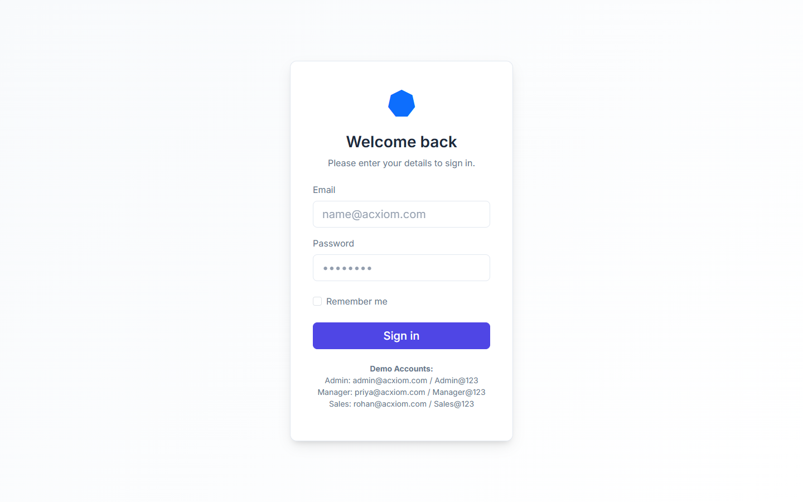
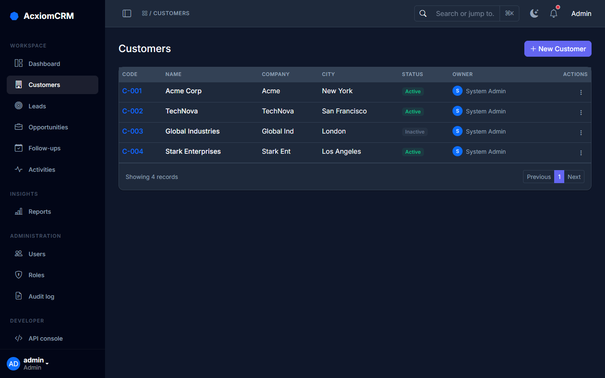
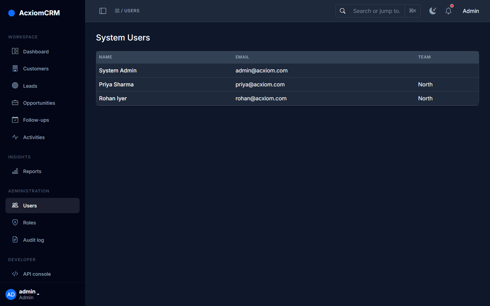
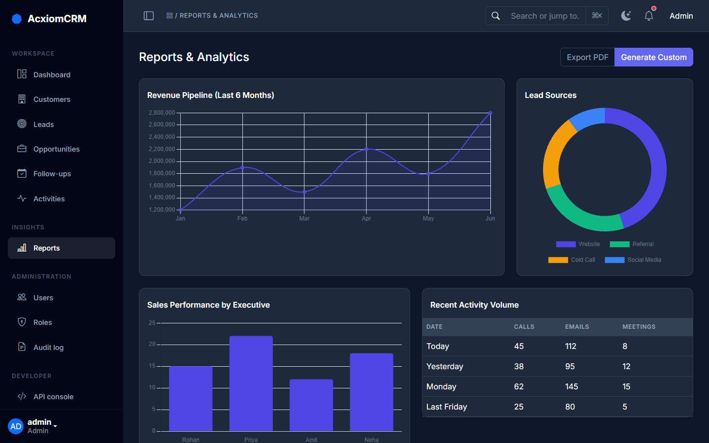

# AcxiomCRM - Functional & Technical Project Documentation

## 1. Document Purpose
This document defines the functional scope, module structure, validation requirements, security requirements, role-based authorization, workflows, REST API expectations, audit requirements, and reporting requirements for the AcxiomCRM application.
The document is intended to serve as a common reference for developers, testers, reviewers, and project evaluators.

## 2. Complete Module Structure

| S.NO | Module | Purpose |
|------|--------|---------|
| 1 | **AcxiomCRM** | Application shell, navigation, common UI, configuration and shared services. |
| 2 | **Auth & Authorization** | Login, logout, password security, policy, lockout, roles and access control. |
| 3 | **Dashboard** | Role-based KPIs, summaries, charts, activities and sales pipeline visibility. |
| 4 | **Customer Management** | Customer master data, contacts, search, edit, status and customer history. |
| 5 | **Lead Management** | Lead capture, qualification, assignment, status, conversion and tracking. |
| 6 | **Follow-Up Management** | Follow-up scheduling, reminders, status, notes and activity history. |
| 7 | **User & Role Management** | User creation, role assignment, activation/deactivation and access administration. |
| 8 | **Opportunity Management**| Opportunity pipeline, amount, probability, expected close date and stage management. |
| 9 | **Audit Log** | Security and business activity tracking with user, timestamp, action and record details. |
| 10| **REST API** | Secure APIs for customers, leads, opportunities, follow-ups, authentication and reporting data. |
| 11| **Reports** | Customer, lead, follow-up, opportunity, sales pipeline, user activity and audit reports. |

## 3. Application Architecture
The CRM application follows a layered architecture (ASP.NET Core MVC) that separates presentation, application processing, business logic, data access, database, and security responsibilities.
- **Presentation Layer:** ASP.NET Core MVC Razor Views, Bootstrap styling, Chart.js for Dashboards.
- **Application Layer:** Controllers handling requests, service coordination, and DTOs.
- **Domain/Business Layer:** Core CRM entities (Customer, Lead, Opportunity), business validations, and role-based workflows.
- **Data Access & Database Layer:** Entity Framework Core (Code-First) over SQLite.
- **Security Layer:** ASP.NET Core Identity for hashing, authorization, and anti-forgery mechanisms.

## 4. Functional Module Requirements

### 4.1 Dashboard
Shows role-based KPIs (Total Customers, Open Leads, Total Opportunities, Pipeline Value) and utilizes Chart.js for data visualization.

### 4.2 Authentication & Authorization
Uses ASP.NET Core Identity. Hashed passwords, account lockout mechanisms, and strict role-based access control (Admin, Manager, Sales Executive).

### 4.3 Customer Management
Complete CRUD operations. Captures name, email, phone, address, status, and assigned executive.

### 4.4 Lead Management
Captures lead source, status (New, Contacted, Qualified, Lost), priority, and pipeline values.

### 4.5 Follow-Up Management
Tracks planned, completed, and missed activities. Follow-up dates cannot be scheduled in the past.

### 4.6 Opportunity Management
Tracks stages (Qualification, Proposal, Negotiation, Won, Lost), Probability (0-100), and Expected Close Date.

### 4.7 User, Role & Audit Management
Admin-only access to user creation, role assignment, and tracking of system-wide changes via the append-only Audit Log.

## 5. Validation Requirements
AcxiomCRM implements rigorous validation:
- **Client-Side:** Unobtrusive jQuery validation for immediate feedback (Required, Email formatting, Phone length).
- **Server-Side:** Mandatory model state validation protecting against HTTP request manipulation.
- **Business Logic:** 
  - *Opportunity Amount* > 0.
  - *Probability* must be 0-100.
  - *Expected Close Date* cannot be in the past.
  - *Follow-Up Date* cannot be earlier than today.

## 6. Authentication & Security Specification
- **Password Security:** Handled securely via ASP.NET Core Identity. Passwords are never stored in plain text.
- **Lockout:** Configurable failed login thresholds lock accounts to prevent brute force attacks.
- **Anti-Forgery:** All state-changing POST requests are protected with `@Html.AntiForgeryToken()`.

## 7. Role-Based Authorization Matrix
| Module | Admin | Manager | Sales Executive |
|--------|-------|---------|-----------------|
| Dashboard | Full | Team | Own/Assigned |
| Customers | Full | Team/Business | Own/Assigned |
| Opportunities | Full | Team | Own/Assigned |
| Audit Log | Full | Limited | No Access |
| User Management | Full | Limited | No Access |

## 8. Core Data Entities
1. **User:** `UserId`, `Name`, `Email`, `Role`
2. **Customer:** `CustomerId`, `Name`, `Email`, `Phone`, `OwnerId`, `Status`
3. **Lead:** `LeadId`, `Source`, `Status`, `ExpectedValue`, `AssignedTo`
4. **Opportunity:** `OpportunityId`, `Stage`, `Amount`, `Probability`, `ExpectedCloseDate`
5. **FollowUp:** `FollowUpDate`, `Type`, `Status`, `Notes`
6. **AuditLog:** `Action`, `EntityName`, `RecordId`, `Timestamp`, `IpAddress`

## 9. REST API Specification
Exposed, authenticated endpoints utilizing DTOs:
- `GET /api/customers`
- `POST /api/customers`
- `GET /api/leads`
- `GET /api/opportunities`

## 10. Reporting Requirements
Reports dynamically filter based on user role (Admin sees all, Sales sees assigned).
- **Pipeline Report:** Stage-wise pipeline amount.
- **Sales Performance:** Visualized metrics of lead conversions and opportunity outcomes.

## 11. Final Acceptance Scenario Checklist
- [x] Unauthenticated users are blocked from protected pages.
- [x] Client-side & Server-side validation block invalid emails and phone numbers.
- [x] Opportunity Amount <= 0 is rejected.
- [x] Opportunity Probability > 100 is rejected.
- [x] Follow-Up dates in the past are rejected.
- [x] Sales Executive login correctly restricts scope.
- [x] Admin login grants access to User/Audit management.
- [x] All CRUD actions generate Audit Log entries.
- [x] Dashboard KPI cards and Chart.js graphics render correctly.
